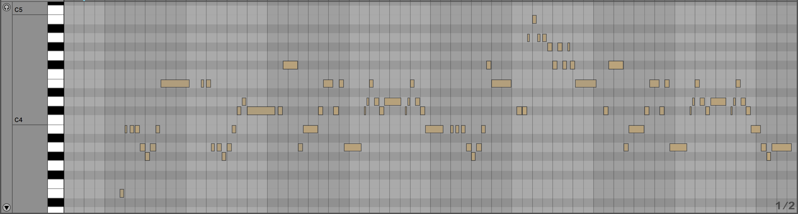

<div align="center">

  <h2 align="center">Music Recombination Using Element-based Genetic Algorithm</h2>

  <p align="center">
    Combining two music melodies while preserving its characteristics using genetic algorithm.
  </p>
</div>
<br />

<p align="middle">
  
</p>
<!-- [](https://www.youtube.com/watch?v=YOUTUBE_VIDEO_ID_HERE) -->

## Features


## Usage
Install requirements
```console
$ pip install requirements.txt
```

Run:
```console
$ python3 src/GeneticAlgorithm.py src/Music/song1.fs src/Music/song2.fs
```
## Requirements
* Python 3.9.9